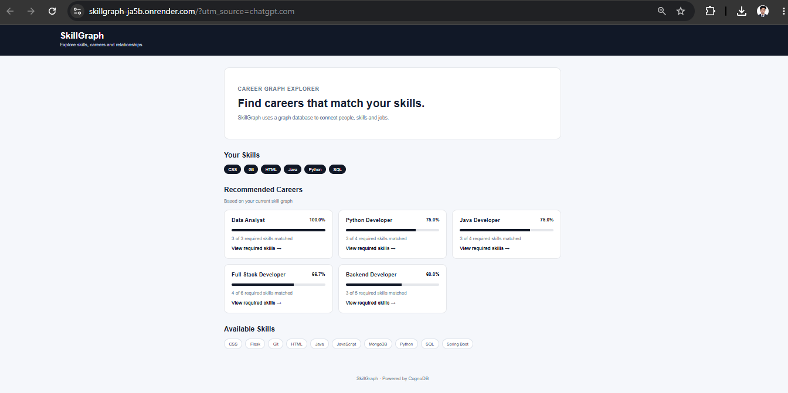
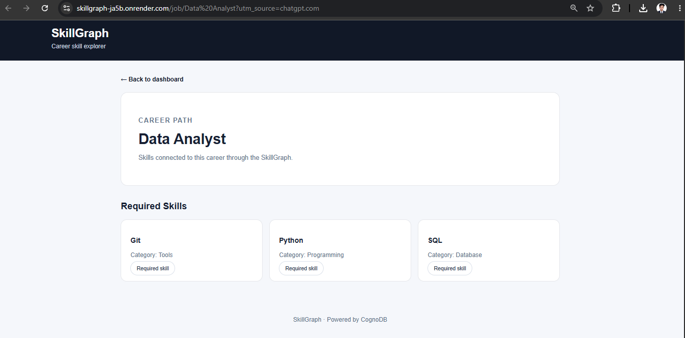
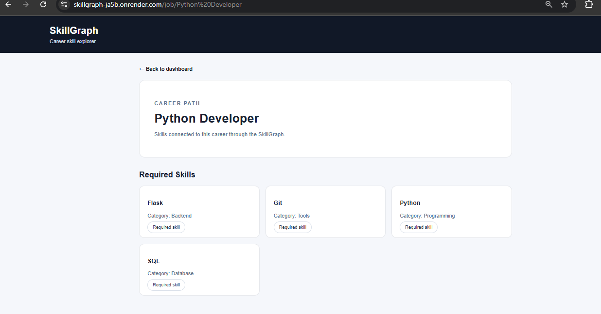

SkillGraph

A graph-powered career discovery application built with Flask and CognoDB.

SkillGraph helps users understand the relationship between their skills and potential career paths. It uses a graph database to connect people, skills, and jobs.

Overview

SkillGraph analyzes a user's skills and recommends suitable career paths based on the skills required by different jobs.

Example Results

| Career | Match |
|---|---:|
| Data Analyst | 100% |
| Python Developer | 75% |
| Java Developer | 75% |
| Full Stack Developer | 66.7% |
| Backend Developer | 60% |

Why a Graph Database?

The main value of SkillGraph comes from relationships between entities.

A relational database could store users, skills, and jobs in separate tables, but relationship-heavy questions would require multiple joins.

For example:

> A user knows Python. Which jobs require Python, and what other skills are connected to those jobs?

In SkillGraph, this can be naturally represented as a graph traversal:

```text
Person
   |
   | HAS_SKILL
   v
Skill
   ^
   | REQUIRES
   |
Job
   |
   | REQUIRES
   v
Related Skill
````

This makes graph traversal a natural fit for the application.

## Graph Data Model

### Nodes

#### Person

Properties:

* name
* role

#### Skill

Properties:

* name
* category

#### Job

Properties:

* title
* category

### Relationships

```text
(:Person)-[:HAS_SKILL]->(:Skill)

(:Job)-[:REQUIRES]->(:Skill)
```

### Data Model Diagram

```text
                 HAS_SKILL
      ┌─────────────────────────┐
      │                         ▼
┌──────────┐              ┌─────────┐
│  Person  │              │  Skill  │
└──────────┘              └─────────┘
                               ▲
                               │
                            REQUIRES
                               │
                               │
                           ┌─────────┐
                           │   Job   │
                           └─────────┘
```

## Features

### 1. Career Matching

The application compares a user's skills with the skills required by available jobs.

It displays:

* Matched skills
* Total required skills
* Match percentage

### 2. Job Details

Users can select a career and view the skills required for that job.

Example:

```text
Data Analyst

Required Skills:
- Python
- SQL
- Git
```

### 3. Skill Connections

Users can explore other skills connected through shared career paths.

For example, Python is connected to skills such as:

* SQL
* Git
* Flask
* MongoDB
* HTML
* CSS
* JavaScript

### 4. Graph Explorer

The Graph Explorer allows users to explore relationships starting from a selected skill.

Example:

```text
Python
   |
   +----> Python Developer
   |
   +----> Full Stack Developer
   |
   +----> Backend Developer
   |
   +----> Data Analyst
```

## Technology Stack

### Backend

* Python
* Flask

### Database

* CognoDB
* OpenCypher
* Neo4j Python Driver

### Frontend

* HTML
* CSS
* Jinja2 Templates

### Configuration

* python-dotenv

## Project Structure

```text
skillgraph/
│
├── app.py
├── database.py
├── queries.py
├── seed.py
├── test_db.py
├── requirements.txt
├── README.md
├── .env
├── .gitignore
│
├── templates/
│   ├── index.html
│   ├── job.html
│   ├── skill.html
│   └── graph.html
│
└── static/
    └── style.css
```

## Main Cypher Queries

### Get All Skills

```cypher
MATCH (s:Skill)
RETURN s.name AS name, s.category AS category
ORDER BY s.name
```

### Get Job Requirements

```cypher
MATCH (j:Job {title: $job_title})-[:REQUIRES]->(s:Skill)
RETURN
    j.title AS job,
    s.name AS skill,
    s.category AS category
ORDER BY s.name
```

The job title is passed as a parameter rather than being concatenated into the Cypher query.

### Get User Skills

```cypher
MATCH (p:Person {name: $person_name})-[:HAS_SKILL]->(s:Skill)
RETURN
    p.name AS person,
    s.name AS skill,
    s.category AS category
ORDER BY s.name
```

## Multi-Hop Graph Traversal

SkillGraph performs multi-hop traversal to discover relationships between skills and careers.

Conceptually:

```text
Person
   ↓ HAS_SKILL
Skill
   ↑ REQUIRES
Job
   ↓ REQUIRES
Related Skill
```

This allows the application to discover related skills through shared jobs.

### Skill Connection Query

```cypher
MATCH (s:Skill {name: $skill_name})
MATCH (s)<-[:REQUIRES]-(j:Job)-[:REQUIRES]->(related:Skill)
WHERE related.name <> s.name
RETURN
    s.name AS skill,
    related.name AS related_skill,
    COUNT(DISTINCT j) AS shared_jobs
ORDER BY shared_jobs DESC, related_skill
```

This is a graph-oriented query that finds skills connected through common job requirements.

## Parameterized Queries

All user-controlled values are passed using Neo4j driver parameters.

Example:

```python
db.run_query(
    query,
    {"person_name": person_name}
)
```

No user input is directly concatenated into Cypher queries.

## Seed Data

The `seed.py` script creates realistic sample graph data.

### Skills

* Python
* SQL
* Java
* HTML
* CSS
* JavaScript
* Git
* Flask
* Spring Boot
* MongoDB

### Jobs

* Python Developer
* Java Developer
* Full Stack Developer
* Backend Developer
* Data Analyst

The script also creates relationships between jobs and their required skills.

## CognoDB Setup

1. Create a CognoDB account.
2. Create a free `c0` database instance.
3. Copy the database connection URI.
4. Store the credentials in a `.env` file.

Example:

```env
COGNODB_URI=bolt+s://your-instance-url
COGNODB_USERNAME=cognodb
COGNODB_PASSWORD=your-password
```

Do not commit `.env` to GitHub.

## Local Setup

### 1. Clone the repository

```bash
git clone YOUR_GITHUB_REPOSITORY_URL
cd skillgraph
```

### 2. Create virtual environment

Windows:

```powershell
python -m venv venv
```

Activate:

```powershell
venv\Scripts\activate
```

### 3. Install dependencies

```powershell
pip install -r requirements.txt
```

### 4. Configure environment variables

Create `.env`:

```env
COGNODB_URI=bolt+s://your-instance-url
COGNODB_USERNAME=cognodb
COGNODB_PASSWORD=your-password
```

### 5. Test database connection

```powershell
python test_db.py
```

Expected:

```text
SUCCESS: Connected to CognoDB!
SkillGraph connected!
```

### 6. Load seed data

```powershell
python seed.py
```

Expected:

```text
Database seeded successfully!
```

### 7. Run the application

```powershell
python app.py
```

Open:

```text
http://127.0.0.1:5000
```

## Application Routes

### Dashboard

```text
/
```

Shows:

* User skills
* Career recommendations
* Match percentages
* Available skills

### Job Details

```text
/job/<job_title>
```

Shows the skills required for a career.

### Skill Details

```text
/skill/<skill_name>
```

Shows related skills connected through shared jobs.

### Graph Explorer

```text
/graph/<skill_name>
```

Shows jobs and related skills connected to a selected skill.

## Error Handling

The application handles database connectivity failures gracefully.

If CognoDB is unavailable, the application displays a user-friendly error message instead of exposing an unhandled database exception.

## Security

Database credentials are stored in environment variables.

The following files are excluded from Git:

```text
.env
venv/
__pycache__/
*.pyc
```

Secrets are never hard-coded into the application source code.

## Screenshots

Add screenshots of the following pages:

1. Dashboard
2. Career Matching
3. Job Details
4. Skill Connections
5. Graph Explorer

## Demo

### Local Demo

```text
http://127.0.0.1:5000
```

### Hosted Demo

Coming soon.

## Future Improvements

* Interactive node-and-edge graph visualization
* User authentication
* Personalized skill profiles
* Skill gap analysis
* Learning resource recommendations
* Job market data integration
* Advanced career recommendation scoring
* Real-time graph analytics

## Assignment

Built as a take-home assignment for Wexa AI.

The project demonstrates:

* Graph data modeling
* CognoDB integration
* OpenCypher queries
* Multi-hop graph traversal
* Parameterized database queries
* Flask web application development
* Error handling
* Career-oriented graph exploration

````

### Save

Notepad-ல்:

Ctrl + S → Close

அதன் பிறகு PowerShell-ல்:

powershell
dir
## Screenshots

### 1. Career Graph Explorer

The main application page shows the user's skills and recommended careers based on skill matches.



### 2. Career Details

The career details page displays the skills required for a selected career.



### 3. Graph Explorer

The Graph Explorer visualizes relationships between skills and careers, including connected jobs and related skills.


